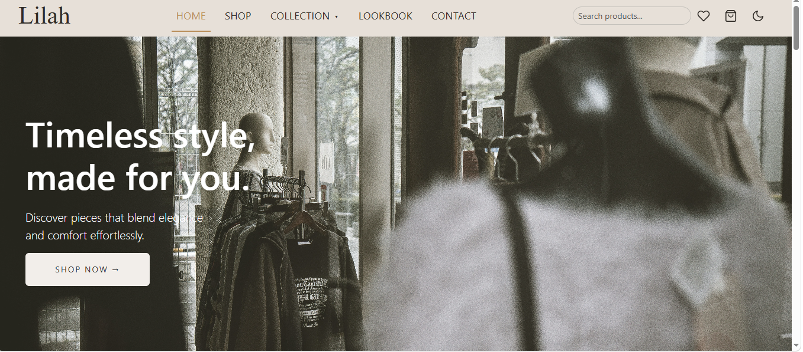

[English](README.md)

# Lilah - متجر أزياء

مشروع تدريبي لواجهة متجر إلكتروني للأزياء (Front-end)، متجاوب مع كل الشاشات، مبني بـ HTML وCSS وJavaScript و**Bootstrap 5**.

**[شاهد النسخة التجريبية](https://noran1o.github.io/Lilah-store-project/)**

> هذا مشروع للتعلم وليس متجراً حقيقياً. لا يوجد دفع، ولا يتم إرسال أي بيانات تكتبها في الصفحة إلى أي مكان.

---

## قصة المشروع

بنيت Lilah على ثلاث مراحل، لأتدرب على الانتقال من الكود العادي إلى استخدام إطار عمل:

1. **النسخة الأصلية (HTML وCSS وJavaScript).**
   صممت وكتبت الصفحة كلها بنفسي: الـ navbar، والقسم الرئيسي (hero)، وكروت المنتجات، وقسم الكولكشن، وكروت الأقسام، واللوك بوك، والنيوزليتر، والفوتر، وزر الدارك مود، وزر العودة للأعلى، وزر إخفاء وإظهار قسم الكولكشن. كان التنسيق يعتمد على `inline-block` وعروض بالنسبة المئوية، فلم تكن الصفحة متجاوبة بعد.

2. **إعادة البناء بـ Bootstrap 5.**
   حوّلت الصفحة لتستخدم الـ grid والـ navbar والكروت والأزرار والنماذج من Bootstrap، وقلّلت الـ CSS الخاص بي إلى ما يميّز التصميم فقط، وجعلتها تعمل من الموبايل إلى الكمبيوتر.

3. **إضافة مميزات جديدة.**
   بعد أن استقر التصميم، أضفت كتالوج منتجات بـ JavaScript، وسلة، وقائمة مفضلة، ومعرض صور، وغيرها (التفاصيل بالأسفل).

## المميزات

**المتجر**
- 32 منتجاً يتم عرضها من array في JavaScript (4 أقسام)
- شرائح للفلترة حسب القسم، وقائمة تظهر عند الوقوف على "Collection" في الـ navbar، وكروت الأقسام، وروابط الفوتر، وكلها تفلتر نفس القائمة
- ترتيب حسب السعر، وبحث مباشر، وزر "Load more"
- كروت منتجات بشارة (New / Sale)، وسعر قديم، وقلب للمفضلة، وزر "Add to cart"

**السلة والمفضلة**
- سلة داخل **Offcanvas** من Bootstrap: تغيير الكمية، والحذف، وإجمالي السعر
- السلة والمفضلة محفوظتان في `localStorage`، فلا تضيعان عند تحديث الصفحة
- قلب الـ navbar يعرض المنتجات المحفوظة فقط

**الواجهة**
- ثيم فاتح وغامق (color modes في Bootstrap 5.3). يتبع إعداد الجهاز في أول زيارة، ثم يتذكر اختيار الزائر
- navbar ثابت مع **Scrollspy** (يميّز القسم الذي تشاهده)
- معرض Lookbook باستخدام **Modal + Carousel**
- نموذج نيوزليتر مع **validation** من Bootstrap ورسائل تأكيد بـ **Toast**
- زر العودة للأعلى، وتحميل الصور عند الحاجة (lazy loading)، ونسبة موحدة لصور المنتجات

## التقنيات المستخدمة

- HTML5
- CSS3 (متغيرات CSS لألوان الثيم)
- JavaScript (ES6 بدون مكتبات)
- [Bootstrap 5.3](https://getbootstrap.com/) عبر CDN
- GitHub Pages للنشر

## ما تعلمته

**Bootstrap**
- نظام الـ 12 عموداً ونقاط التوقف (`col-6 col-md-4 col-lg-3`)
- الـ navbar القابل للطي، والكروت، والنماذج، وال input groups
- تخصيص أزرار Bootstrap بمتغيرات CSS بدلاً من إعادة كتابتها
- المكونات: Offcanvas وModal وCarousel وToast وScrollspy وform validation
- الوضع الغامق باستخدام `data-bs-theme`

**JavaScript**
- فصل البيانات (array من objects) عن الـ HTML ورسم الصفحة منها
- استخدام `map` و`filter` و`sort` و`slice` على بيانات حقيقية
- بناء الـ HTML باستخدام template literals
- نمط "الحالة (state) + دالة `render()`": الأزرار تغيّر الحالة، ودالة واحدة تعيد رسم الصفحة
- Event delegation ليعمل الزر حتى لو أُنشئ ديناميكياً
- استخدام `localStorage` مع `JSON.stringify` و`JSON.parse`

**CSS**
- المتغيرات (custom properties) لعمل ثيم فاتح وغامق
- `aspect-ratio` و`object-fit` لتظهر الصور المختلفة بشكل متناسق
- العناصر الثابتة (sticky) ومسافات التمرير

**النشر وحل المشاكل**
- GitHub Pages يفرّق بين الحروف الكبيرة والصغيرة: `Style.css` ليس نفس `style.css`
- قراءة أخطاء 404 في الـ Console بأدوات المطور
- أهمية تصغير الصور قبل رفعها

## هيكل المشروع

| الملف | وظيفته |
|---|---|
| `index.html` | هيكل الصفحة |
| `style.css` | التنسيقات الخاصة فوق Bootstrap |
| `products.js` | بيانات المنتجات |
| `script.js` | المتجر والسلة والمفضلة والمعرض والثيم والنماذج |
| `images/` | الصور |

## تشغيل المشروع محلياً

1. حمّل المشروع أو انسخه (clone)
2. افتح المجلد في VS Code وشغّله بإضافة **Live Server** (فتح `index.html` مباشرة قد يعمل بشكل مختلف في بعض المتصفحات)

## أفكار للمرحلة القادمة

- عرض سريع للمنتج (Quick view) مع اختيار المقاس
- صفحة دفع تجريبية
- صفحات الأسئلة الشائعة ودليل المقاسات والتواصل
- نسخة عربية كاملة بتنسيق من اليمين إلى اليسار (RTL)
- صور أصغر ومحسّنة لتحميل أسرع

## المصادر والشكر

- صور المنتجات واللوك بوك من [Unsplash](https://unsplash.com/) ومصوريها. صورتان من اللوك بوك تم إنشاؤهما بـ ChatGPT.
- الأيقونات عبارة عن SVG مبنية على [Feather Icons](https://feathericons.com/) (رخصة MIT).
- أسماء العلامات التجارية أو الشعارات التي تظهر في الصور ملك لأصحابها. هذا المشروع للتدريب فقط.

## عن صاحبة المشروع

**NORAN AHMED**
[LinkedIn](https://www.linkedin.com/in/noran-a-5282b6296/)

